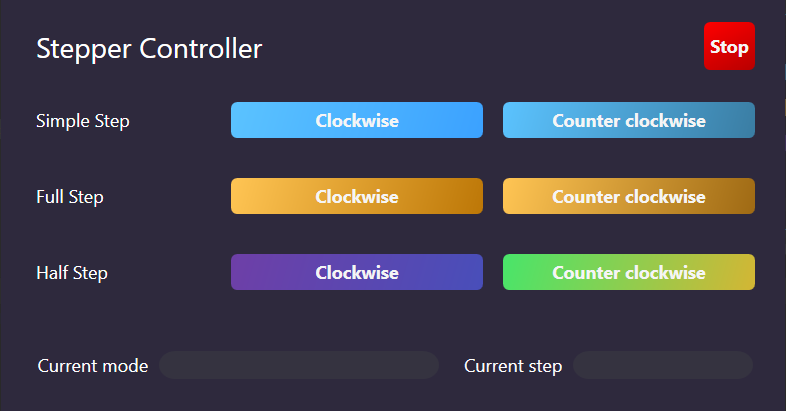

# Stepper Controller

This is a simple desktop app for a stepper motor controller. It is made using WPF with .NET Framework 4.8. It can be built with Rider IDE or Visual Studio.

It is intended to Work alongside this [Arduino](https://github.com/CesarJZO/Arduino) repo, specifically with the StepperMotor circuit.

## App user interface

